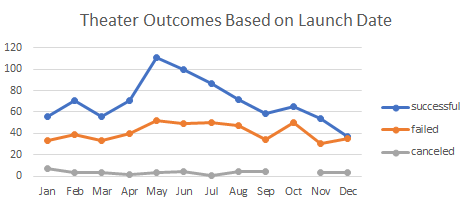
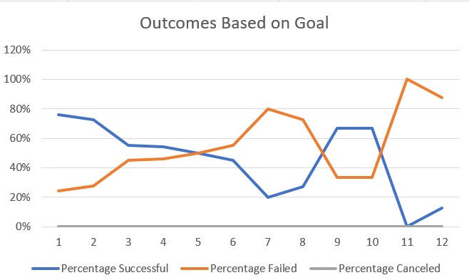

# Kickstarting with Excel

## Overview of Project
This report aims to show how Kickstarter campaigns performed based on their launch dates and their funding goals. 
### Purpose
The client wants to fund her play, Fever, via crowdfunding. With the information provided from the previous analysis, she has launched her campaign on Kickstarter. This analysis aims to enable her to understand outcomes of Kickstarter campaigns, specifically campaigns categorized as plays, based on their launch dates and based on the goals set. Her project goal is $10,000. 
## Analysis and Challenges
The analyst evaluated a Kickstarter dataset using Excel. 
### Analysis of Outcomes Based on Launch Date

This chart shows the outcomes (successful, failed, or canceled) of theater Kickstarter campaigns based on the month that their campaigns were launched. The most successful month for theater campaigns is May. Very few theater campaigns get canceled, instead many more fail. The month with the most failed campaigns is October, with 50 total theater campaigns failing. However, December has the fewest successful campaigns. In December, it's about as likely for a theater campaign to fail as it is to succeed, with just 37 successful campaigns and 35 failed ones. 
### Analysis of Outcomes Based on Goals

This chart shows the percentage of successful and failed campaigns based on their goals. Dollar amounts for goals have been grouped into bins to be able to show on a diagram. 
### Challenges and Difficulties Encountered
During the analysis of this data set, the Excel program froze. This is likely due to the large amount of data contained within the file. When this happened, the analyist restored previous versions of the Excel file. 
## Results

- What are two conclusions you can draw about the Outcomes based on Launch Date?
The month with the overall most successful outcomes for campaigns is May. The month with the most failed outcomes is October.

- What can you conclude about the Outcomes based on Goals?
Projects with goals less than $1000 have the highest rate of successful outcomes. Projects with goals between $15,000 and $19,999 have an equal chance of succeeding or failing. 

- What are some limitations of this dataset?
There is very little data for projects that have goals greater than $24999 so the percentage successful and percentage failed above that point may not be accurate or misleading. 

- What are some other possible tables and/or graphs that we could create?
A different Outcomes Based on Goals chart could be created by using the total amount of projects instead of the amount of projects in each bin. 
